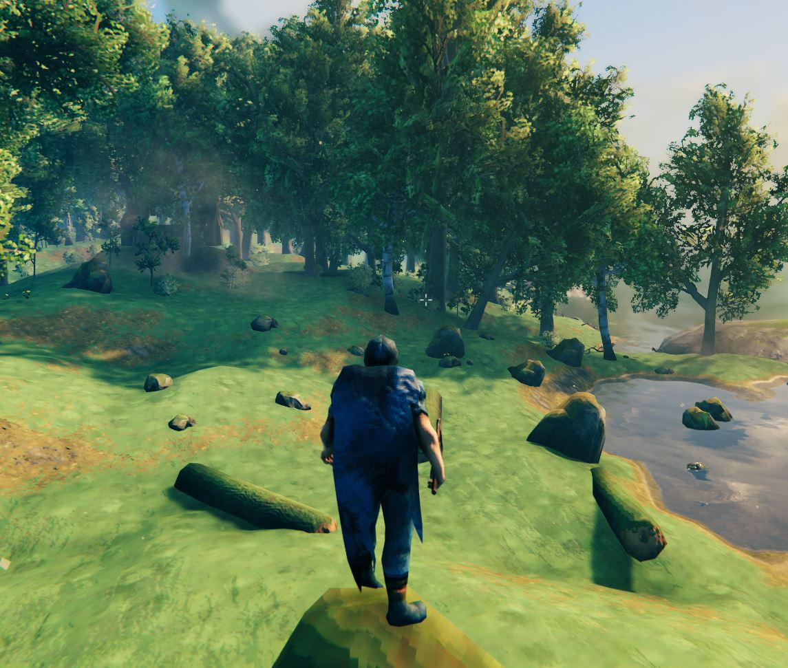
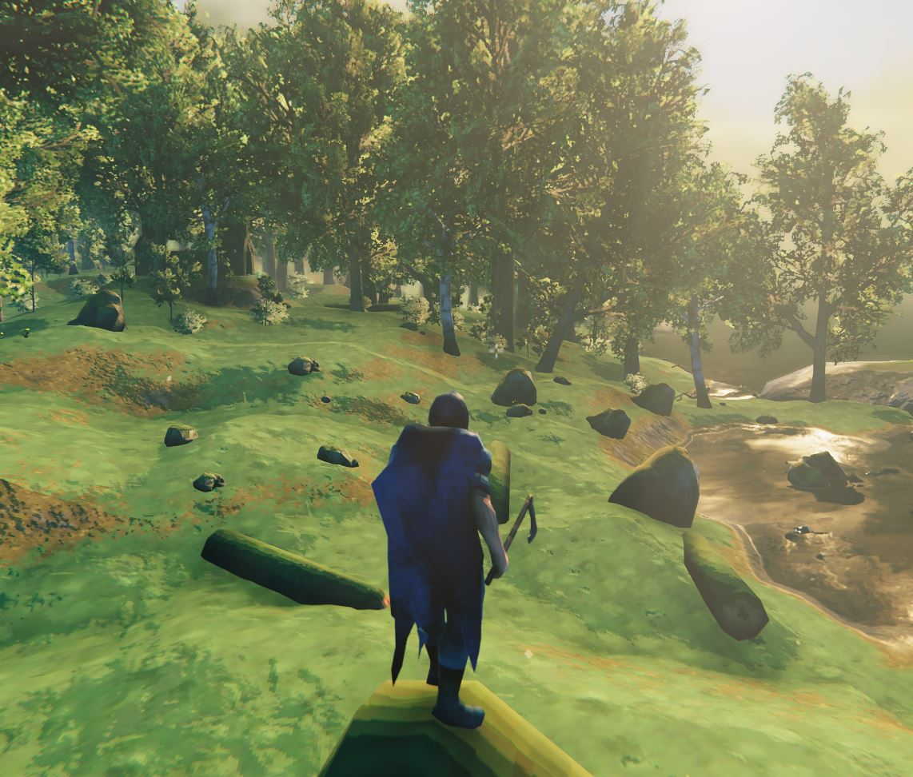
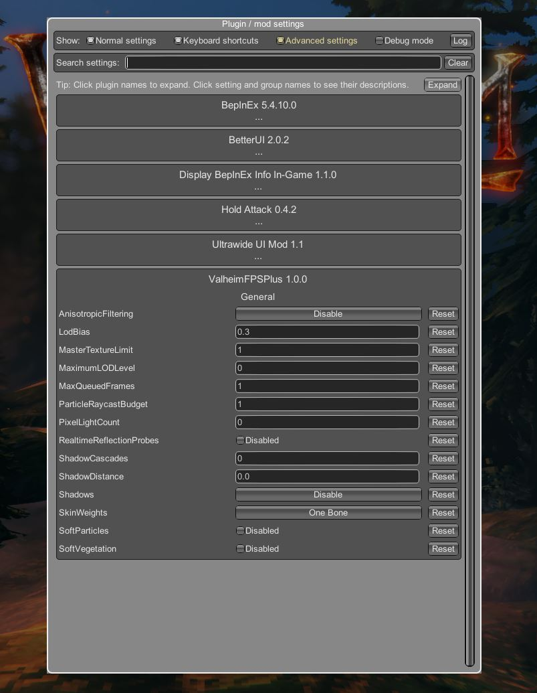

# ValheimFPSPlus

This mod allows you to change the quality settings Valheim doesn't give you access to. The configuration uses BepInEx's builtin config-system. This allows a configuration even while the game is running.

The default configutation of this mod uses settings to maximize the game's framerate. Especially in regions where multible shadow-casting lightsources like bonfires and portals are present, this mod can make the diffrerence between slideshow and playable framerate.

## Without Mod

## With Mod

# Installation (manual)

A general guide:

1. Install the [BepInEx](https://valheim.thunderstore.io/package/denikson/BepInExPack_Valheim/) mod loader.
2. Extract the archive into a folder. **Do not extract into the game folder.**
3. Move the contents of `plugins` folder into `<GameDirectory>\BepInEx\plugins`.
4. Run the game.

# Configuration

To configute this mod you can use the config file `<GameDirectory>\BepInEx\config\KillerGoldFisch.ValheimFPSPlus.cfg` (The config file gets created during the first start of the game with the mod installed).

Or you can use [BepInEx's ConfigurationManager](https://github.com/BepInEx/BepInEx.ConfigurationManager) for the configutation in-game :

# Setting

## NoSnowstorms

Replaces the resource-hungry snowstorm with normal snow

### Valheim Default

`false`

### Recommended

`true`

## [AnisotropicFiltering](https://docs.unity3d.com/ScriptReference/QualitySettings-anisotropicFiltering.html)

Anisotropic filtering mode.

| Value       | Description                                            |
|-------------|--------------------------------------------------------|
| Disable     | Disable anisotropic filtering for all textures.        |
| Enable      | Enable anisotropic filtering, as set for each texture. |
| ForceEnable | Enable anisotropic filtering for all textures.         |

### Valheim Default

`ForceEnable`

### Recommended

`Disable`

## [LodBias](https://docs.unity3d.com/ScriptReference/QualitySettings-lodBias.html)

Global multiplier for the LOD's switching distance.
A larger value leads to a longer view distance before a lower resolution LOD is picked.

### Valheim Default

`2.0`

### Recommended

`0.3`

## [MasterTextureLimit](https://docs.unity3d.com/ScriptReference/QualitySettings-masterTextureLimit.html)

Setting this to one uses the first mipmap of each texture (so all textures are half size), setting this to two uses the second mipmap of each texture (so all textures are quarter size), etc.. This can be used to decrease video memory requirements on low-end computers. The default value is zero.

0 => no limit

### Valheim Default

`0`

### Recommended

`1`

## [MaximumLODLevel](https://docs.unity3d.com/ScriptReference/QualitySettings-maximumLODLevel.html)

A maximum LOD level. All LOD groups.

0 => no maximum

### Valheim Default

`0`

### Recommended

`0`

## [MaxQueuedFrames](https://docs.unity3d.com/ScriptReference/QualitySettings-maxQueuedFrames.html)

Maximum number of frames queued up by graphics driver.

Graphics drivers can queue up frames to be rendered. When CPU has much less work to do than the graphics card, is it possible for this queue to become quite large. In those cases, user's input will "lag behind" what is on the screen.

Use QualitySettings.maxQueuedFrames to limit maximum number of frames that are queued. On PC, the default value is 2, which strikes the best balance between frame latency and framerate.

Note that you can reduce input latency by using a smaller maxQueuedFrames because the CPU will be waiting until the graphics card finishes rendering previous frames. The downside of this however, is that it can result in a lower framerate.

### Valheim Default

`2`

### Recommended

`1`

## [ParticleRaycastBudget](https://docs.unity3d.com/ScriptReference/QualitySettings-particleRaycastBudget.html)

Budget for how many ray casts can be performed per frame for approximate collision testing.

### Valheim Default

`4096`

### Recommended

`1`

## [PixelLightCount](https://docs.unity3d.com/ScriptReference/QualitySettings-pixelLightCount.html)

The maximum number of pixel lights that should affect any object.

If there are more lights illuminating an object, the dimmest ones will be rendered as vertex lights.

### Valheim Default

`8`

### Recommended

`0`

## [RealtimeReflectionProbes](https://docs.unity3d.com/ScriptReference/QualitySettings-realtimeReflectionProbes.html)

Enables realtime reflection probes.

### Valheim Default

`True`

### Recommended

`False`

## [ShadowCascades](https://docs.unity3d.com/ScriptReference/QualitySettings-shadowCascades.html)

Number of cascades to use for directional light shadows.

### Valheim Default

`4`

### Recommended

`0`

## [ShadowDistance](https://docs.unity3d.com/ScriptReference/QualitySettings-shadowDistance.html)

Shadow drawing distance.

### Valheim Default

`150.0`

### Recommended

`0`

## [Shadows](https://docs.unity3d.com/ScriptReference/QualitySettings-shadowDistance.html)

Determines which type of shadows should be used.

The available options are Hard and Soft Shadows, Hard Shadows Only and Disable Shadows.

| Value    | Description            |
|----------|------------------------|
| Disable  | Disable Shadows.       |
| HardOnly | Hard Shadows Only.     |
| All      | Hard and Soft Shadows. |

### Valheim Default

`All`

### Recommended

`Disable`

## [SkinWeights](https://docs.unity3d.com/ScriptReference/QualitySettings-skinWeights.html)

The maximum number of bones per vertex that are taken into account during skinning, for all meshes in the project.

The value can be either One Bone, Two Bones, Four Bones or Auto. Note that higher bone counts may have a performance cost, especially above 4 bones per vertex.

| Value     | Description                                      |
|-----------|--------------------------------------------------|
| OneBone   | One bone affects each vertex.                    |
| TwoBones  | Two bones affect each vertex.                    |
| FourBones | Four bones affect each vertex.                   |
| Unlimited | An unlimited number of bones affect each vertex. |

### Valheim Default

`FourBones`

### Recommended

`OneBone`

## [SoftParticles](https://docs.unity3d.com/ScriptReference/QualitySettings-softParticles.html)

Should soft blending be used for particles?

### Valheim Default

`True`

### Recommended

`False`

## [SoftVegetation](https://docs.unity3d.com/ScriptReference/QualitySettings-softVegetation.html)

Use a two-pass shader for the vegetation in the terrain engine.

If enabled, vegetation will have smoothed edges, if disabled all plants will have hard edges but are rendered roughly twice as fast.

### Valheim Default

`True`

### Recommended

`False`

# Changehistory

## `1.1.1` 2021-08-09

 * Change default value of `LodBias` from `0.3` to `1.3`

## `1.1.0` 2021-08-09

 * Add `NoSnowstorms` option